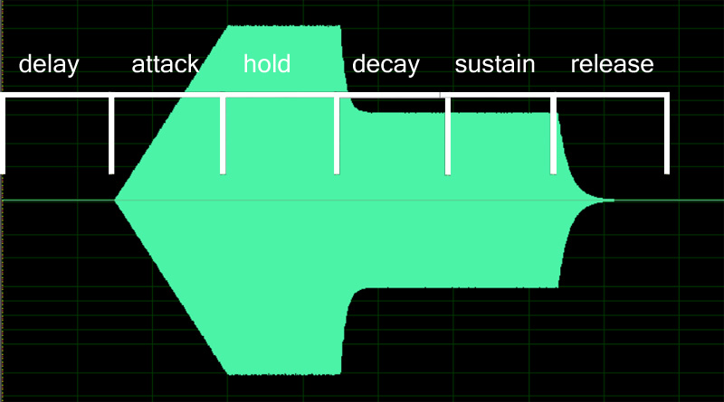

## Examples

```
ampeg_attack=1.2
fileg_attack=0.1
```

## Practical Considerations

These are very frequently used, especially with amplifier envelopes.
`ampeg_attack` is the standard "A" in the basic ADSR volume envelope.
`fileg_attack` is key to 303-style basses.

In ARIA, the SFZ1 envelopes have linear attack (for `pitcheg` and `fileg`,
probably linear in cents, which won't translate into linear in Hertz).
Decay and release stages have a curve which is faster than linear, and it
seems to match "well enough"  with a multiplicatively decreasing curve.
The step size should be close to
$$ \mu = \exp \left( - \frac{8.0}{t \times s} \right) $$
where $$t$$ is the decay duration in seconds, and $$s$$ is the sample rate in Hertz.
The envelope $$x_{n+1}$$ at index $$n+1$$ is thus computed as
$$ x_{n+1} = \mu \times x_{n}. $$

Here is a screenshot of a file output using Sforzando, showing the
ampeg_envelope shape and its stages.


