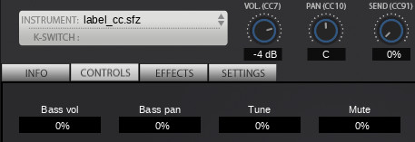

Used under the ‹[control]› header.
Some DAWs will display those labels as parameter names, and Sforzando will also
use them in the Control tab if no GUI is defined.

## Examples

```
label_cc30=Bass vol
label_cc31=Bass pan
label_cc32=Tune
label_cc33=Mute
```




[control]: {{ '/headers/control' | relative_url }}
