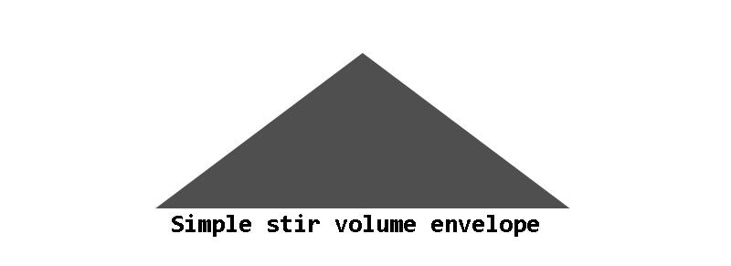
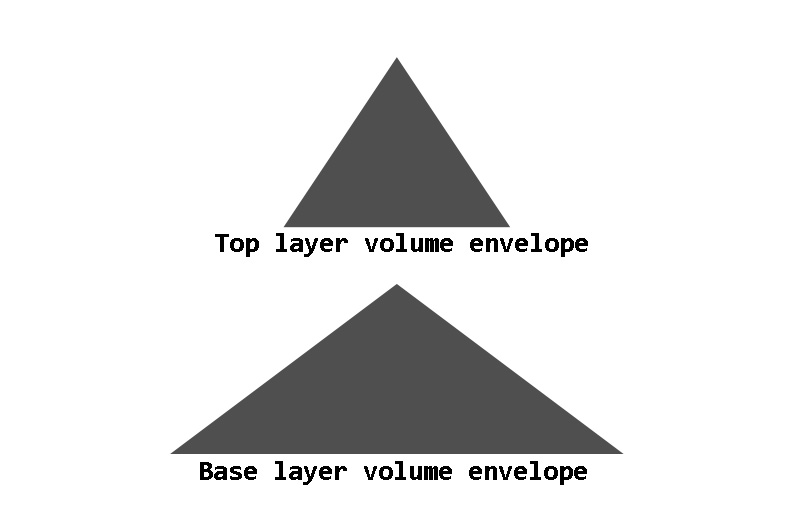
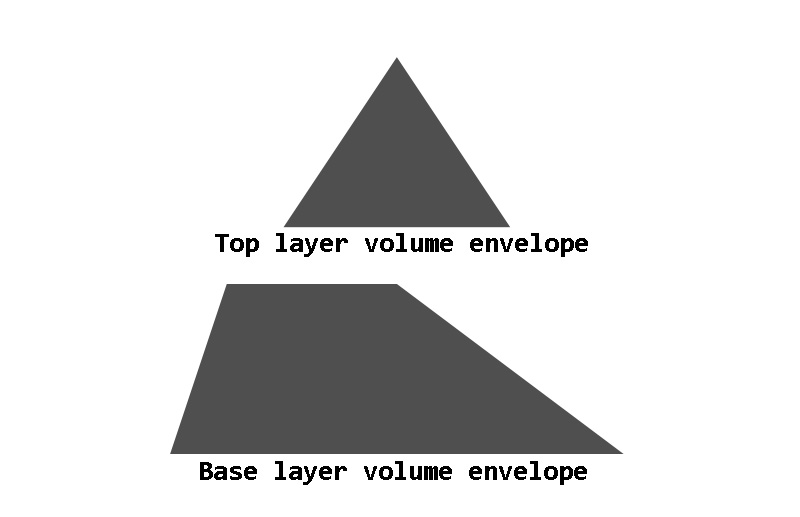
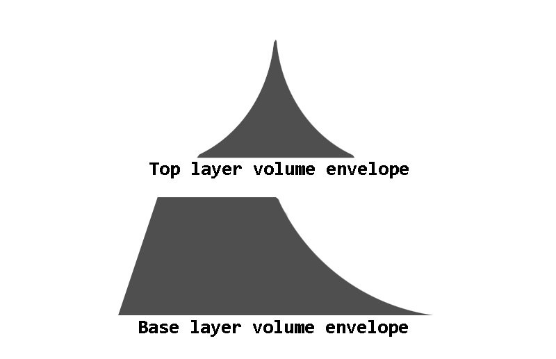

Not all drum sounds are hits which can be used in the usual way described in our
[drum basics][1] article. One major exception are brush techniques which involve
scraping the brush across a drum head, often in a circle. If you are not sure what
this looks or sounds like, [this video is a good guide][2].
These techniques are called swirls or stirs, and for the purpose of this article
we'll call them stirs. As the sound changes in intensity, and the duration
of the scrapes needs to fit the tempo and rhythm of the song, sampling them
requires a different approach to the usual drum hits. The two common approaches
are to completely ignore this technique and not sample it at all, and to record
loops to fit various tempos.

This article describes another approach. The key principle here
is that stirs are a noisy, nonlinear sound with a lot of randomness, which
makes them very easy to crossfade or loop with no phase issues. Therefore,
instead of trying to record stirs performed in a realistic way, we propose
recording long, unrealistically steady stirs with no perceptible rhythm or
expression, and then using those samples as source material for building up
a musical stir.

## Recording the source material

For the purposes of this example, let's assume the source stirs are recorded
at four speeds, with 1 being the slowest and 4 being the fastest. Speed 1 is
slow enough that a full circle around the head of the drum is completed in
more than 4 seconds. That's enough to fill a measure at 60 bpm and still have
some sound left, so the user can start the next stir before the previous one
ends, and thus achieve a continuous sound. Speed 4 is several circles per
second, to match the speed at which the brush would be moving during the peak
of an aggressive stir. Making the sound steady at this speed is a challenge.

As for how long the recordings need to be, speed 1 needs to be long enough
for the longest stir we want to be able to make. However, if tuning controls
are to be applied, it's important to remember that pitching a sample up
shortens it, so if the tuning range is to extend to one octave up, then a
10-second sample is the minimum to make a 5-second stir. Speeds 3 and 4
are not used thorughout the duration of a stir but only for peaks, and for
the purposes of this example they can be half the length of speed 1.

## Simple stir model

We can make a very simple stir using speed 1 by playing the sample with
[loop_mode][3] set to one_shot, like we normally would set it for a
drum hit, and using a simple [volume envelope][4] to fade this sample
in over a time, and then fade it out.

```
<region>key=26 loop_mode=one_shot
sample=snare_stir_speed_1.wav
ampeg_attack=1.0 ampeg_decay=1.0 ampeg_sustain=0
```

The resulting volume envelope will look something like this. The illustrations are
not precise, only general shapes.



This is a good start, and we can add expression and realism by layering a
faster speed on top of it near the stir's peak, with half the duration
of the base layer. We use ampeg_delay to delay the start of the second
layer by the same amount, so the peaks of both layers align in time.

```
<region>key=26 loop_mode=one_shot
sample=snare_stir_speed_1.wav
ampeg_attack=1.0 ampeg_decay=1.0 ampeg_sustain=0
<region>key=26 loop_mode=one_shot
sample=snare_stir_speed_3.wav
ampeg_delay=0.5 ampeg_attack=0.5 ampeg_decay=0.5 ampeg_sustain=0
```



## Modulating stir duration

This has a fixed duration and is not flexible, but the stir length can
easily be modulated by a single CC parameter changing all the
envelope durations. Extremely short stirs, lasting only a small fraction
of a second, are obviously not going to sound realistic, so we can use
a minimum value to prevent that. Let's use CC1 (standard mod wheel).

```
<region>key=26 loop_mode=one_shot
sample=snare_stir_speed_1.wav
ampeg_attack=0.1 ampeg_decay=0.1 ampeg_sustain=0
ampeg_attackcc1=0.4 ampeg_decaycc1=0.4
<region>key=26 loop_mode=one_shot
sample=snare_stir_speed_3.wav
ampeg_delay=0.05 ampeg_attack=0.05 ampeg_decay=0.05 ampeg_sustain=0
ampeg_delaycc1=0.25 ampeg_attackcc1=0.25 ampeg_decaycc1=0.25
```

## Making the shape more realistic

Drummers testing the above model have asked for some adjustments to
make it sound more realistic. One is to make the first half of the base
layer steadier. This can be done very easily by shortening the attack
and adding a hold time to the envelope, ensuring that they still add up
to the same amount of time that the faster layer's delay and attack,
so the peak will remain aligned at all values of the modulation
parameter. The attack stage should generally be shorter than the hold
stage.

```
<region>key=26 loop_mode=one_shot
sample=snare_stir_speed_1.wav
ampeg_attack=0.05 ampeg_hold=0.05 ampeg_decay=0.1 ampeg_sustain=0
ampeg_attackcc1=0.05 ampeg_holdcc1=0.35 ampeg_decaycc1=0.4
<region>key=26 loop_mode=one_shot
sample=snare_stir_speed_3.wav
ampeg_delay=0.05 ampeg_attack=0.05 ampeg_decay=0.05 ampeg_sustain=0
ampeg_delaycc1=0.25 ampeg_attackcc1=0.25 ampeg_decaycc1=0.25
```



Also, the peak should be sharper and more accented than it is
with linear envelopes. Changing the envelope curves accomplishes this,
though the initial attack envelope of the base layer can remain
linear. The below values seem like a decent start.

```
<region>key=26 loop_mode=one_shot
sample=snare_stir_speed_1.wav
ampeg_attack=0.05 ampeg_hold=0.05 ampeg_decay=0.1 ampeg_sustain=0
ampeg_attackcc1=0.05 ampeg_holdcc1=0.35 ampeg_decaycc1=0.4
ampeg_attack_shape=0.0 ampeg_decay_shape=-1.4
<region>key=26 loop_mode=one_shot
sample=snare_stir_speed_3.wav
ampeg_delay=0.05 ampeg_attack=0.05 ampeg_decay=0.05 ampeg_sustain=0
ampeg_delaycc1=0.25 ampeg_attackcc1=0.25 ampeg_decaycc1=0.25
ampeg_attack_shape=3.5 ampeg_decay_shape=-1.4
```



## Adjusting the envelope shapes

The above fixed envelope shapes are good for medium tempos and energy levels,
but for slow tempos the flat envelope shapes actually work quite well, and
more energetic tracks might sound better with even sharper envelope peaks. It
would be nice to adjust the envelope curve shapes with MIDI CC, but it is not
currently possible to do this. It's possible to work around this by crossfading
sharp-envelope and flat-envelope regions, or use locc/hicc to select between
several pre-baked [envelope shapes][5]. Here's an example of the latter method.

```
<group>key=26 loop_mode=one_shot

<region>hicc100=42
sample=snare_stir_speed_1.wav
ampeg_attack=0.05 ampeg_hold=0.05 ampeg_decay=0.1 ampeg_sustain=0
ampeg_attackcc1=0.05 ampeg_holdcc1=0.35 ampeg_decaycc1=0.4
ampeg_attack_shape=0.0 ampeg_decay_shape=0.0
<region>hicc100=42
sample=snare_stir_speed_3.wav
ampeg_delay=0.05 ampeg_attack=0.05 ampeg_decay=0.05 ampeg_sustain=0
ampeg_delaycc1=0.25 ampeg_attackcc1=0.25 ampeg_decaycc1=0.25
ampeg_attack_shape=0.0 ampeg_decay_shape=0.0

<region>locc100=43 hicc100=86
sample=snare_stir_speed_1.wav
ampeg_attack=0.05 ampeg_hold=0.05 ampeg_decay=0.1 ampeg_sustain=0
ampeg_attackcc1=0.05 ampeg_holdcc1=0.35 ampeg_decaycc1=0.4
ampeg_attack_shape=0.0 ampeg_decay_shape=-1.4
<region>locc100=43 hicc100=86
sample=snare_stir_speed_3.wav
ampeg_delay=0.05 ampeg_attack=0.05 ampeg_decay=0.05 ampeg_sustain=0
ampeg_delaycc1=0.25 ampeg_attackcc1=0.25 ampeg_decaycc1=0.25
ampeg_attack_shape=3.5 ampeg_decay_shape=-1.4

<region>locc100=87
sample=snare_stir_speed_1.wav
ampeg_attack=0.05 ampeg_hold=0.05 ampeg_decay=0.1 ampeg_sustain=0
ampeg_attackcc1=0.05 ampeg_holdcc1=0.35 ampeg_decaycc1=0.4
ampeg_attack_shape=0.0 ampeg_decay_shape=-3.5
<region>locc100=87
sample=snare_stir_speed_3.wav
ampeg_delay=0.05 ampeg_attack=0.05 ampeg_decay=0.05 ampeg_sustain=0
ampeg_delaycc1=0.25 ampeg_attackcc1=0.25 ampeg_decaycc1=0.25
ampeg_attack_shape=5.2 ampeg_decay_shape=-3.5
```

## Adding ornaments

So far, we have a stir with adjustable duration and shape which peaks
halfway through. More complex patterns can have more than one peak,
though. A simple way to emulate that is to use a differnet MIDI note
to trigger short ornaments which will add a brief extra sound to the
stir, thus emulating a momentary acceleration of the brush. We can use
one of the higher stir speeds for this.

```
<group>key=27 loop_mode=one_shot sample=snare_stir_speed_2.wav
ampeg_attack=0.05 ampeg_decay=0.05 ampeg_sustain=0
ampeg_attackcc1=0.2 ampeg_decaycc1=0.2

<region>hicc100=42
ampeg_attack_shape=0.0 ampeg_decay_shape=0.0

<region>hicc100=42
ampeg_attack_shape=3.5 ampeg_decay_shape=-1.4

<region>hicc100=42
ampeg_attack_shape=5.2 ampeg_decay_shape=-3.5
```

## Accents

We can also create accents, which are similar to the typical stir but peak much
more quickly and use faster speeds. In pracitce, they can be used either as
short, aggressive stirs, or added on top of basic stirs to create more complex
patterns. The difference in the SFZ here is that the attack curve shape can be applied to
the attack portion as well, and there is no hold stage in the envelope.

```
<group>key=28 loop_mode=one_shot

<region>hicc100=42
sample=snare_stir_speed_2.wav
ampeg_attack=0.05 ampeg_decay=0.1 ampeg_sustain=0
ampeg_attackcc1=0.05 ampeg_decaycc1=0.4
ampeg_attack_shape=0.0 ampeg_decay_shape=0.0
<region>hicc100=42
sample=snare_stir_speed_4.wav
ampeg_attack=0.05 ampeg_decay=0.05 ampeg_sustain=0
ampeg_attackcc1=0.05 ampeg_decaycc1=0.2
ampeg_attack_shape=0.0 ampeg_decay_shape=0.0

<region>locc100=43 hicc100=86
sample=snare_stir_speed_2.wav
ampeg_attack=0.05 ampeg_decay=0.1 ampeg_sustain=0
ampeg_attackcc1=0.05 ampeg_decaycc1=0.4
ampeg_attack_shape=3.5 ampeg_decay_shape=-1.4
<region>locc100=43 hicc100=86
sample=snare_stir_speed_4.wav
ampeg_attack=0.05 ampeg_decay=0.05 ampeg_sustain=0
ampeg_attackcc1=0.05 ampeg_decaycc1=0.2
ampeg_attack_shape=3.5 ampeg_decay_shape=-1.4

<region>locc100=87
sample=snare_stir_speed_2.wav
ampeg_attack=0.05 ampeg_decay=0.1 ampeg_sustain=0
ampeg_attackcc1=0.05 ampeg_decaycc1=0.4
ampeg_attack_shape=5.2 ampeg_decay_shape=-3.5
<region>locc100=87
sample=snare_stir_speed_4.wav
ampeg_attack=0.05 ampeg_decay=0.05 ampeg_sustain=0
ampeg_attackcc1=0.05 ampeg_decaycc1=0.2
ampeg_attack_shape=5.2 ampeg_decay_shape=-3.5
```

## Muting

As all the above sounds have loop_mode set to one_shot, triggering a note causes
the sound to play until the volume envelope drops to zero. If ending a stir
earlier than that is required, we can use polyphony groups. The [group][6]
and [off_by][7] opcodes are the key ones here. We can use them to make stirs
self-mute, so that triggering a new stir will mute any previously playing stirs,
as well as add a key which produces no sound, using [silence instead of a sample][8],
but
is in the same mute groups, so triggering this key will mute any stir or accent
currently playing. This key can be used to stop stirs early.

Note that, as usual, separate groups are needed for
layers which are to play simultaneously, and if there are multiple microphone
positions then those would need separate groups as well. In the below example we
also have stirs mute accents, and vice versa, although the ornaments are left
out of the mute groups and can be layered on top of other sounds without muting them.
For a more sophisticated use of mute groups with other pieces of the drum kit,
please see [cymbal muting][9].

```
<global>loop_mode=one_shot off_mode=normal
ampeg_release=0.1 ampeg_releasecc1=0.2

<group>key=26

<region>hicc100=42
sample=snare_stir_speed_1.wav
ampeg_attack=0.05 ampeg_hold=0.05 ampeg_decay=0.1 ampeg_sustain=0
ampeg_attackcc1=0.05 ampeg_holdcc1=0.35 ampeg_decaycc1=0.4
ampeg_attack_shape=0.0 ampeg_decay_shape=0.0
group=1 off_by=1
<region>hicc100=42
sample=snare_stir_speed_3.wav
ampeg_delay=0.05 ampeg_attack=0.05 ampeg_decay=0.05 ampeg_sustain=0
ampeg_delaycc1=0.25 ampeg_attackcc1=0.25 ampeg_decaycc1=0.25
ampeg_attack_shape=0.0 ampeg_decay_shape=0.0
group=2 off_by=2

<region>locc100=43 hicc100=86
sample=snare_stir_speed_1.wav
ampeg_attack=0.05 ampeg_hold=0.05 ampeg_decay=0.1 ampeg_sustain=0
ampeg_attackcc1=0.05 ampeg_holdcc1=0.35 ampeg_decaycc1=0.4
ampeg_attack_shape=0.0 ampeg_decay_shape=-1.4
group=1 off_by=1
<region>locc100=43 hicc100=86
sample=snare_stir_speed_3.wav
ampeg_delay=0.05 ampeg_attack=0.05 ampeg_decay=0.05 ampeg_sustain=0
ampeg_delaycc1=0.25 ampeg_attackcc1=0.25 ampeg_decaycc1=0.25
ampeg_attack_shape=3.5 ampeg_decay_shape=-1.4
group=2 off_by=2

<region>locc100=87
sample=snare_stir_speed_1.wav
ampeg_attack=0.05 ampeg_hold=0.05 ampeg_decay=0.1 ampeg_sustain=0
ampeg_attackcc1=0.05 ampeg_holdcc1=0.35 ampeg_decaycc1=0.4
ampeg_attack_shape=0.0 ampeg_decay_shape=-3.5
group=1 off_by=1
<region>locc100=87
sample=snare_stir_speed_3.wav
ampeg_delay=0.05 ampeg_attack=0.05 ampeg_decay=0.05 ampeg_sustain=0
ampeg_delaycc1=0.25 ampeg_attackcc1=0.25 ampeg_decaycc1=0.25
ampeg_attack_shape=5.2 ampeg_decay_shape=-3.5
group=2 off_by=2

<group>key=27 sample=snare_stir_speed_2.wav
ampeg_attack=0.05 ampeg_decay=0.05 ampeg_sustain=0
ampeg_attackcc1=0.2 ampeg_decaycc1=0.2

<region>hicc100=42
ampeg_attack_shape=0.0 ampeg_decay_shape=0.0

<region>hicc100=42
ampeg_attack_shape=3.5 ampeg_decay_shape=-1.4

<region>hicc100=42
ampeg_attack_shape=5.2 ampeg_decay_shape=-3.5

<group>key=28

<region>hicc100=42
sample=snare_stir_speed_2.wav
ampeg_attack=0.05 ampeg_decay=0.1 ampeg_sustain=0
ampeg_attackcc1=0.05 ampeg_decaycc1=0.4
ampeg_attack_shape=0.0 ampeg_decay_shape=0.0
group=1 off_by=1
<region>hicc100=42
sample=snare_stir_speed_4.wav
ampeg_attack=0.05 ampeg_decay=0.05 ampeg_sustain=0
ampeg_attackcc1=0.05 ampeg_decaycc1=0.2
ampeg_attack_shape=0.0 ampeg_decay_shape=0.0
group=2 off_by=2

<region>locc100=43 hicc100=86
sample=snare_stir_speed_2.wav
ampeg_attack=0.05 ampeg_decay=0.1 ampeg_sustain=0
ampeg_attackcc1=0.05 ampeg_decaycc1=0.4
ampeg_attack_shape=3.5 ampeg_decay_shape=-1.4
group=1 off_by=1
<region>locc100=43 hicc100=86
sample=snare_stir_speed_4.wav
ampeg_attack=0.05 ampeg_decay=0.05 ampeg_sustain=0
ampeg_attackcc1=0.05 ampeg_decaycc1=0.2
ampeg_attack_shape=3.5 ampeg_decay_shape=-1.4
group=2 off_by=2

<region>locc100=87
sample=snare_stir_speed_2.wav
ampeg_attack=0.05 ampeg_decay=0.1 ampeg_sustain=0
ampeg_attackcc1=0.05 ampeg_decaycc1=0.4
ampeg_attack_shape=5.2 ampeg_decay_shape=-3.5
group=1 off_by=1
<region>locc100=87
sample=snare_stir_speed_4.wav
ampeg_attack=0.05 ampeg_decay=0.05 ampeg_sustain=0
ampeg_attackcc1=0.05 ampeg_decaycc1=0.2
ampeg_attack_shape=5.2 ampeg_decay_shape=-3.5
group=2 off_by=2

<group>key=29 sample=*silence

<region>group=1 off_by=1
<region>group=2 off_by=2
```

It is, of course, possible to apply [round robins][10] and [dynamic layers][11]
to this, just like any other drum sound. That is left as an exercise to the reader.

## Alternative approach

The above approach was developed to be playable from an electronic drum kit
controller. For keyboard controllers or sequencing, another approach is possible
where instead of using a MIDI note to trigger a new stir every time the drummer
would complete a circle, we hold down a long note for as long as we want to produce
stirs (so, possibly for several measures, or even the entire duration of a song).
We then [use MIDI CC to crossfade between the layers][12] to
modulate the speed of the stir in order to create realism and rhythmic interest.
In order to be able to do this, the samples will have to be looped, but as stated
at the beginning, looping or crossfading noisy samples is very easy as there are
no phase issues. We also set the [loop_mode][3] opcode to continuous
instead of the one_shot setting used in the earlier approach.

```
<group>key=26 loop_mode=continuous ampeg_release=0.25
<region>sample=snare_stir_speed_1.wav xfin_locc1=0 xfin_hicc1=31 xfout_locc1=32 xfout_hicc1=63
<region>sample=snare_stir_speed_2.wav xfin_locc1=32 xfin_hicc1=63 xfout_locc1=64 xfout_hicc1=95
<region>sample=snare_stir_speed_3.wav xfin_locc1=64 xfin_hicc1=95 xfout_locc1=96 xfout_hicc1=127
<region>sample=snare_stir_speed_4.wav xfin_locc1=96 xfin_hicc1=127
```

In practice, this approach has proven more difficult to use, with it being easy
to sound obviously unrealistic by moving the MIDI CC parameter too quickly or
staying at high values for too long. With care, however, it can produce realistic
results, and it is extremely flexible.

## Further possibilities

The brush flutter technique can be treated similarly to the base layer of the stirs.
There is no need to layer faster and slower flutters. In theory, this approach
could also be extended to other noisy, highly nonlinear sounds which can vary
in duration - perhaps shakers. The main challenge there would be to record shakers
shaking smoothly for an extended duration.

It is also certainly possible to further improve the above model with more realism
and playablity.


[1]:  drum_basics
[2]:  https://www.youtube.com/watch?v=R982CdhRF9E
[3]:  {{ '/opcodes/loop_mode' | relative_url }}
[4]:  {{ '/modulations/envelope_generators#sfz-1-egs' | relative_url }}
[5]:  {{ '/opcodes/ampeg_attack_shape' | relative_url }}
[6]:  {{ '/opcodes/group' | relative_url }}
[7]:  {{ '/opcodes/off_by' | relative_url }}
[8]:  {{ '/opcodes/sample' | relative_url }}
[9]:  cymbal_muting
[10]: {{ '/opcodes/seq_position' | relative_url }}
[11]: {{ '/opcodes/lovel' | relative_url }}
[12]: {{ '/opcodes/xfin_loccN' | relative_url }}
