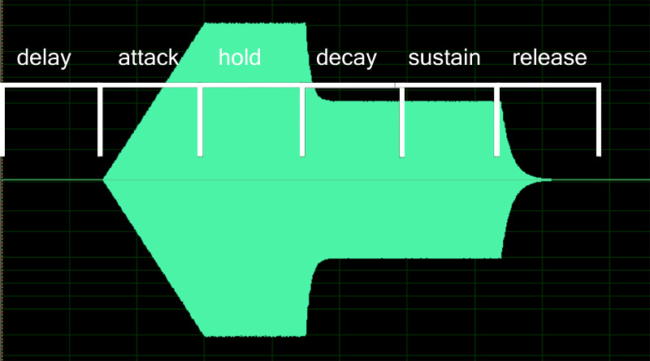

Envelope generators (EGs) are used to control the profile of the volume, filter,
 pitch, or other parameter, based on the timing of the key press and release
(including sustain / sostenuto pedal release.) These are often called "ADSRs",
after the four parameters (Attack, Decay, Sustain, Release) that were used
to control envelopes in early synthesizers (and many current ones as well.)

See [SFZ1 Modulations] to see examples of how these can be applied.

SFZ has two types of EGs: SFZ1 and SFZ2.

## SFZ1: DSAHDSR

SFZ1 envelopes are sometimes called DSAHDSR after the 7 controls of the envelope,
which are applied in the order given below. An EG can control a variety of parameters,
but to help understand, you can imagine it controlling the volume, in which case you
can substitute "volume" for "EG" below.

| 
Parameter
 | Suffix | Description
| ---                   | ---       | ---
| Delay time (s)        | \_delay   | time to wait after key is depressed until the EG starts
| Start **level** (%)   | \_start   | level at which to start
| Attack time (s)       | \_attack  | time from note start (at start level) to 100% level
| Hold time (s)         | \_hold    | time the volume is held at 100% level
| Decay time[^1] (s)    | \_decay   | time[^3] for the volume to decrease from 100% to the sustain level
| Sustain **level** (%) | \_sustain | the % level at which the EG remains while the key is down or the sustain pedal is down
| Release time[^2]      | \_release | time[^3] for the EG to decrease to zero.  This begins when both key and sustain pedal are released, even if the prior stages have not completed.

Here is a screenshot of an audio file created using Sforzando,
showing the ampeg envelope shape and its stages.
Note that this image assumes the Start level is 0.
If it were nonzero, the tip of the left-pointing arrow would look chopped off vertically.

Here's a play-by-play explanation, when using the EG for volume (ampeg_xxx).
When the key is depressed, Delay time elapses and then the note starts
(at Start level, which above is the default of 0.)
The volume increases (at a constant dB/sec rate) for the Attack time and then
reaches the peak level for that note
(which is controlled by the velocity and possibly other parameters.)
The volume stays at that level for the Hold time, after which it falls off
for the Decay time until it reaches the Sustain level.
It remains at that level until the key and sustain pedal are both released,
when it takes the Release time to fall off to silence.

Note that when using an envelope generator to control volume,
it is usually not necessary to adjust release or decay times based on velocity:
that will happen naturally. That is, if I configure `ampeg_release`=1
and play a very loud note, that note will decay with a rate
so that one second later it will be about 90 dB quieter than when it started.
If I play a very soft note, that note will also decay with the same rate,
so that 1 second later it will be 90 dB quieter when it started.
That's pretty close to how most natural instruments behave.

Another note when using an envelope to control volume:
if you're playing a sample that already has a natural envelope,
such as the pluck of a harp string, you normally don't have to configure
the envelope because it's already in the sample,
which has a natural attack and decay.
However, you'll still probably want to configure a release,
so that if the key is released before the sample is finished,
it doesn't end abruptly. With most natural instruments,
this release rate varies with pitch, but not velocity.

## SFZ2

The SFZ2 standard has a more flexible generator that can be used in addition to
the above. This is briefly described in [SFZ2 Modulations:Envelopes].

## References

[^1]: Decay time is actually a constant decay **rate** that is specified
      as the time for the EG to go from 100% to **0%**.
      However, this can be changed by setting xxx_decay_zero=0
      to instead mean to decay from 100% to **sustain level** in the given time,
      from the actual sustain level.

[^2]: Release time is actually a constant decay **rate** that is specified
      as the time for the EG to go from the **sustain level** to zero.
      However, this can be changed setting by xxx_release_zero=1
      to instead mean to decay from **100%** to zero in the given time.

[^3]: When using an amp envelope generator, "0%" means "silence"
      but it's actually interpreted as -90dBFS for Aria, or -80dBFS for original sfz.
      This adjustment is needed because volume is contolled in dB,
      and silence in dB is negative infinity, which complicates the math.

[SFZ1 Modulations]:           sfz1_modulations
[SFZ2 Modulations:Envelopes]: sfz2_modulations#envelopes
